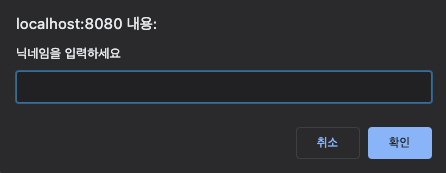
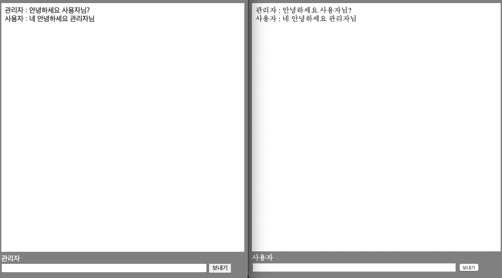

# SimpleSocketChat

간단한 웹 소켓(gorilla)를 활용한 다대다 채팅방 구현

1. 개발 환경
    - macOS Big Sur : ver. 11.52
    - IDE : Goland
    - Go version : 1.17
    - gorilla

2. 간단하게 고릴라를 이용한 웹소켓 만들기  
 
실행 화면 
1. 처음 http://localhost:8080 을 접속하면 닉네임 입력창이 나옵니다.

2. 닉네임 입력후 바로 채팅 입력
